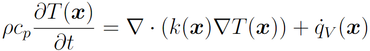
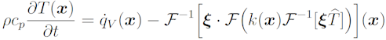
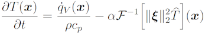
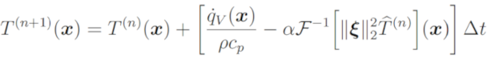
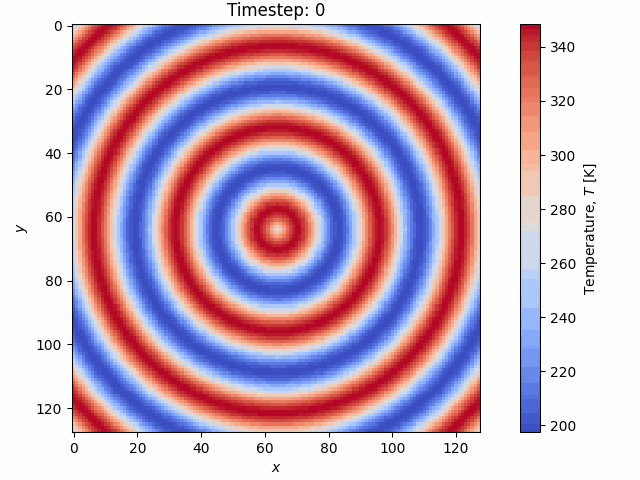
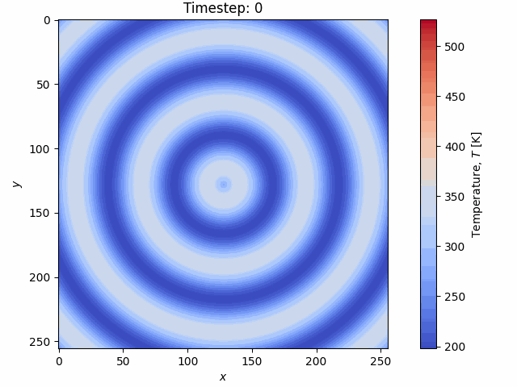
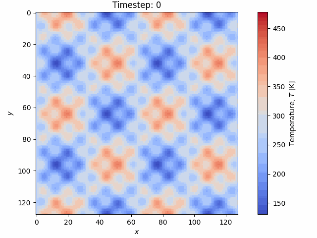

# CS179 GPU Computing Project

This is my GPU computing project for solving the time-dependent anisotropic heat equation with FFTs on the GPU. 

# Usage Instructions

## Setup

The FFTW library is required to run the CPU code. There is a bash script in the `lib/` directory that automatically downloads and builds FFTW. It can be built using:

```
bash /lib/build_fftw.sh
```

These files may already exist in the .zip file. For the GPU code, cuda and the cufft library are required. These are expected to be installed in the directory `/usr/local/cuda`. Python is also required for visualization and the `numpy`, `matplotlib`, and `gif` python libraries are required.

They can be installed with

```
pip install numpy matplotlib gif
```

## Running the Code

The following line will build, run, compare, and visualize the CPU and GPU versions of the code:

```
make all && ./bin/cpu_demo && ./bin/gpu_demo && ./bin/compare_sol && python3 src/plot_solution.py
```

You can change inputs to the code by modifying `/src/input_file.txt`. Input options are described in [the input file section](#input-file). Some example input files are given in `/src/`. 

**NOTE**: The code will *always* read input from `/src/input_file.txt`, so you must either copy the content from the other example files into this file, or rename them to this file. This is unfortunately necessary as the Python code must also read the input file.

## Finer Details

The above command is all that is necessary to run. However, for more specific details on running each portion of the code, see below; otherwise, skip to [Project Description](#project-description)

<details><summary>Click here for the finer details</summary>

### Running CPU Code

The following three steps are required:

* Compile the code `make cpu_demo`
* Run code with `./bin/cpu_demo`
* Visualize results with `python3 src/plot_solution.py`

You can run all the necessary commands in one line as

`make cpu_demo && ./bin/cpu_demo && python3 src/plot_solution.py`

The standalone CPU code is contained in the `cpu_demo.cpp/h` and `cpu_heat_equation.cpp/h` files.

### Running GPU Code

The following three steps are required:

* Compile the code `make gpu_demo`
* Run code with `./bin/gpu_demo`
* Visualize results with `python3 src/plot_solution.py`

You can run all the necessary commands in one line as

`make cpu_demo && ./bin/cpu_demo && python3 src/plot_solution.py`

The standalone GPU code is contained in the `gpu_demo.cpp/h` and `gpu_heat_equation.cu/cuh` files. The other files are common helper functions for the CPU and GPU code.

### Comparing CPU and GPU Code

The CPU and GPU solutions are compared in a seperate file that reads the `.bin` files and compares the entries. To compare the CPU and GPU solutions, build and run `compare_sol`.

* Compile the code `make compare_sol`
* Run code with `./bin/compare_sol`

</details>

# Project Description

This code solves the time-dependent heat equation over a rectangular grid using FFTs. The heat equation is a parabolic partial differential equation with the following form:



The main idea behind solving the heat equation with FFTs is that derivatives in real space become a multiplication by the spatial frequency in Fourier space. We leverage this to compute all the spatial derivatives required for the Laplacian(T) (homogeneous) or div(k*grad(T)) (heterogeneous) that appears in the heat equation. Once we compute these, the problem becomes a simple ODE that we can integrate using any time-integration technique, of which we use forward Euler and 4th-order Runge-Kutta.

At the core of the program, we are simply just performing FFTs, IFFTs, and local point-wise operations in the correct sequence to compute the right-hand side of the heat equation. In the case of heterogeneous materials properties where *k* varies in space, the solution is more complicated and takes the following form:



In the case that *k* is constant, the solution is simpler, easier, and faster to compute than the heterogeneous case:



Once we evaluate the right-hand side of the above equations, we are left with a simple ODE that we can solve with any [numerical integration method](https://en.wikipedia.org/wiki/Numerical_methods_for_ordinary_differential_equations). Here we use the explicit Euler or explicit 4th-order Runge-Kutta methods. The explicit Euler integration equation is given below:



and the 4th-order Runge-Kutta is not shown as it is requires four evaluations of the right-hand side and is thus a very long equation. 

All of the FFTs are performed using the highly optimized FFTW and cufft libaries, for CPU and GPU, respectively. This general solution method is less flexible than finite-difference methods as periodic boundary conditions are *strictly* enforced, but is much faster as a result.

## Features

The main features of the code are as follows:
* Support for multiple time integration schemes (explicit Euler and explicit 4th-order Runge-Kutta).
* Homogeneous and heterogeneous material properties are both supported (for spatial variability of *k*).
* Volumetric heat generation supported.
* Arbitrary grid dimensions, time steps, and initial conditions (examples provided) are supported.

# Results

Once run, all code outputs will be in the `bin` folder. Assuming you run the multi-command given in [Running the Code](#Running-the-Code), the Python visualization code should be run, and the .gif visualizations should also be output. There *should* not be any difference between the CPU and GPU visualization (otherwise that would be bad :).

## Examples

The following examples are the resulting visualizations from the four provided example input files: `input_file.txt`, `input_file_example_2.txt` `input_file_example_3.txt`, and `input_file_example_4.txt`. You can also run these yourself to reproduce the results (as a reminder, see [Running the Code](#Running-the-Code)).

Example 1 - `input_file.txt` - Checkerboard pattern heterogeneous property field and no heat generation. The top left and lower right regions have a much lower heat transfer coefficient $k$ than the other two regions.



Example 2 - `input_file_example_2.txt` - Homogeneous property field and constant heat generation. Both heat transfer and heat generation are simultaneously occuring here.



Example 3 - `input_file_example_3.txt` - Homogeneous property field and centralized heat generation. Again, both heat transfer and heat generation are simultaneously occuring here.



Example 4 - `input_file_example_4.txt` - Heterogeneous property field split in half and no heat generation. The right half of the domain has a much lower heat transfer coefficient $k$ than the left half.


# Performance Analysis

In general, the following options will affect the performance as follows:
* Increasing grid size and number of time steps increases run time
* Forward Euler is faster than 4th order Runge-Kutta
* Homogeneous is faster than heterogeneous (homogeneous means no spatial variation in the material properties)
* The run time is invariant to the initial conditions

The following table shows the CPU and GPU performance of nine different tests with different inputs.

| Grid Size | Time Integration Method | Homogeneous? | Timesteps | CPU Run Time (s) | GPU Run Time (s) | GPU Speedup Factor |
| --- | --- | --- | --- | --- | --- | --- |
| 128² | Forward Euler | Yes | 1000 | 1.28 | 0.136 | 9.4x |
| 128² | Forward Euler | No | 1000 | 3.16 | 0.287 | 11.0x |
| 128² | 4th Order Runge-Kutta | Yes | 1000 | 4.85 | 0.354 | 13.7x |
| 128² | 4th Order Runge-Kutta | No | 1000 | 12.38 | 0.902 | 13.7x |
| 256² | Forward Euler | Yes | 1000 | 5.30 | 0.359 | 14.8x |
| 256² | Forward Euler | No | 1000 | 13.50 | 0.634 | 21.3x |
| 256² | 4th Order Runge-Kutta | Yes | 1000 | 20.80 | 0.827 | 25.2x |
| 256² | 4th Order Runge-Kutta | No | 1000 | 53.44 | 1.910 | 28.0x |
| 512² | 4th Order Runge-Kutta | No | 1000 | 229.0 | 6.96 | 32.9x |

# Input File

The following inputs are required within `input_file.txt`:

* `Nx` - Number of grid points in x-direction
* `Ny` - Number of grid points in y-direction
* `timesteps` - Number of time steps
* `time_increment` - Time increment (seconds)
* `method` - Explicit time integration method. **Options**:
    * `euler` - Explicit Euler time scheme
    * `rk4` - Explicit 4th-order Runge-Kutta scheme
* `spatial_variation` - Spatial variation of *k*. **Options**:
    * `constant` - Homogeneous *k* (i.e., *k*(*x*)=*k*)
    * `half` - Heterogeneous *k* field where *k* is very small (slow heat transfer) in half of the domain and high in the other half
    * `checkerboard` - Heterogeneous *k* field similar to the above option, but in a checkerboard pattern
    * **Note**: The value of *k* in the low heat transfer region will simply be *k*/10 for the two non-homogeneous options. The code can handle any arbitrary grid of heat transfer coefficients, but this just simplifies the input file
* `initial_temperature` - Defines the initial temperature field. **Options**:
    * `sine` - Sinusoidal field with a low- and high-frequency component
    * `pyramid` - Pyramidal temperature field maximum in the center
    * `droplet` - Temperature field that looks like the waves of a water droplet
    * `constant` - Constant temperature everywhere
* `heat_generation` - Defines heat generation field. **Options**:
    * `none` - No heat generation anywhere
    * `constant` - Constant heat generation everywhere
    * `sine` - Large heat generation at the center that tapers off to zero at the edges
* `cp` - Material heat capacity (J/K)
* `rho` - Material density (kg/m^3)
* `k` - Material heat transfer coefficient (W/m K)

# Other Notes

All code is commented with Doxygen commands, and there is a Doxyfile that can be used to generate basic documentation. Otherwise, the code should be commented well enough to explain what everything does.